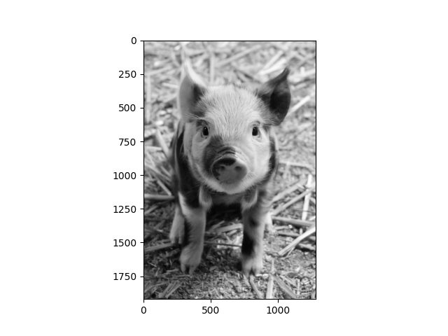
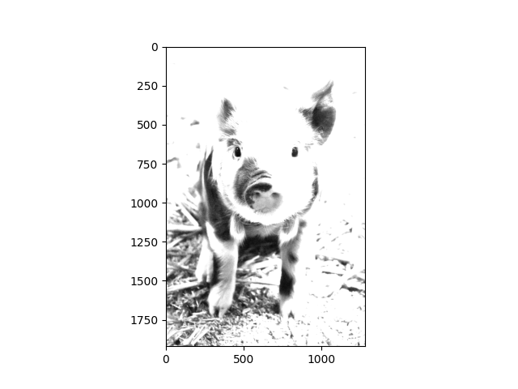
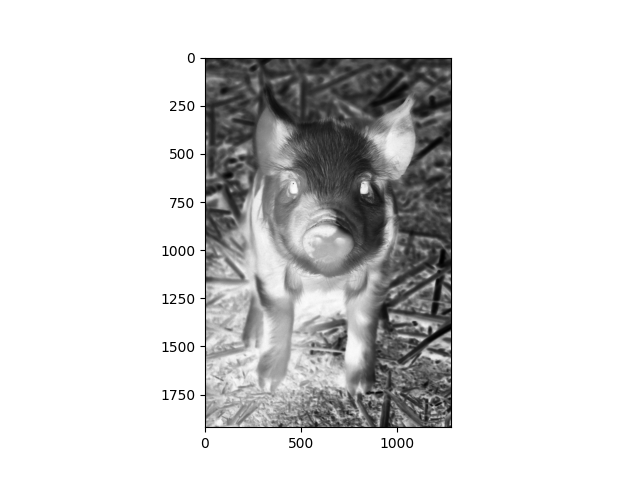
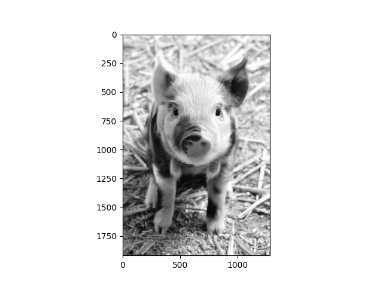
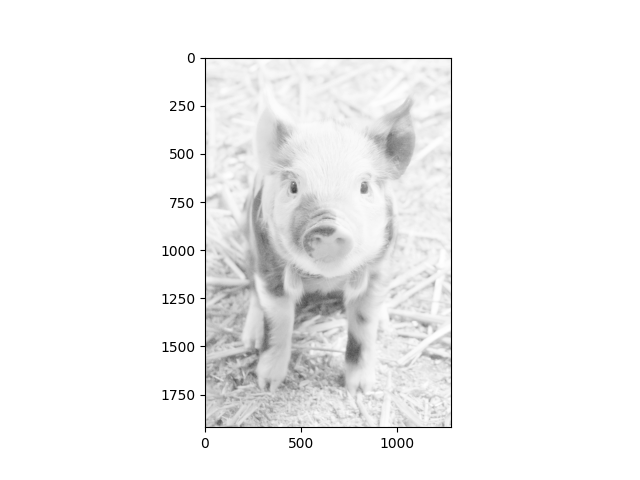
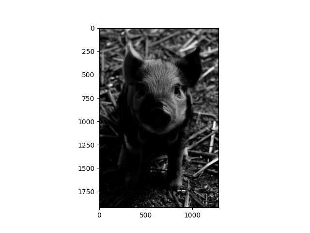
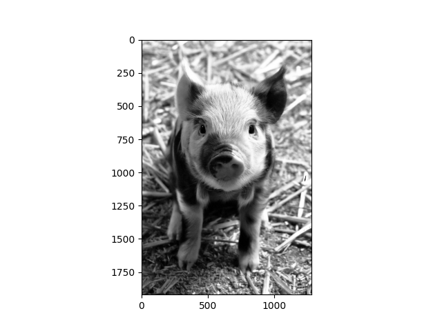

# Digital Image Processing Intensity Transformations

## Description
This project includes implementation of some intensity transformations in Digital Image Processing for 8-bit images:
- Linear transformation: $f(i) = \alpha i + \beta$ (custom $\alpha$ and $\beta$)
- Negative transformation: $f(i) = -i + 255$ (a special case of linear transformation)
- Piecewise linear transformation (with 2 custom transformation function breaking points)
- Logarithmic transformation: $f(i) = [\frac{255\ log(i+1)}{log(256)}]$
- Power-law transformation: $f(i) = [ci^\gamma]$ (custom $\gamma$ and calculated appropriate $c$)
- Histogram equalization

## Usage
1. set "img_path" variable in "main.py" to input image's path. (Images will be converted to grayscale.)
2. Execute the python file corresponding to transformation of choice.
    - Linear transformation: "linear.py"
    - Negative transformation: "negative.py"
    - Piecewise linear transformation: "piecewise_linear.py"
    - Logarithmic transformation: "logarithmic.py"
    - Power-law transformation: "power_law.py"
    - Histogram equalization: "histogram_equalization.py"
3. Enter requested custom parameters if necessary.
4. Transformed output image will be shown.

## Sample Outputs
### Grayscale input:

### Linear transformation ($\alpha=2, \beta=50$):

### Negative transformation:

### Piecewise linear transformation $((a_1, b_1) = (75, 100), (a_2, b_2) = (225, 250))$:

### Logarithmic transformation:

### Power-law transformation ($\gamma = 4$):

### Histogram equalization:

## Attributions
Sample image:
<figure>
   
  <figcaption>
     <a href="https://www.publicdomainpictures.net/en/view-image.php?image=24588&picture=cute-piglet">Cute Piglet</a> 
     by <a href="https://www.publicdomainpictures.net/en/browse-author.php?a=1">Petr Kratochvil</a> 
     is licensed under <a href="https://creativecommons.org/publicdomain/zero/1.0/">CC0</a>.
  </figcaption>
</figure>
