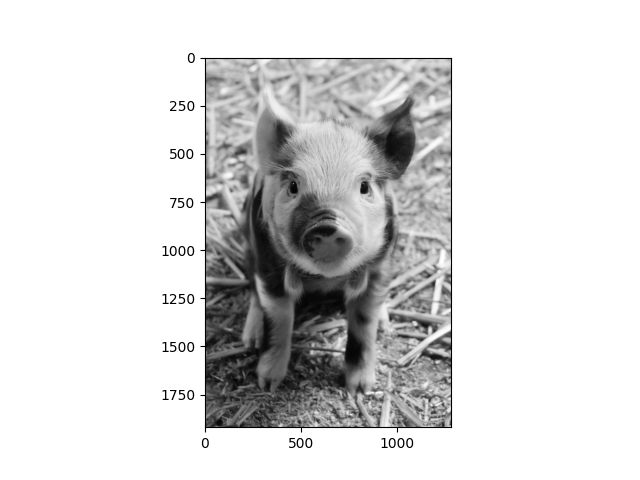
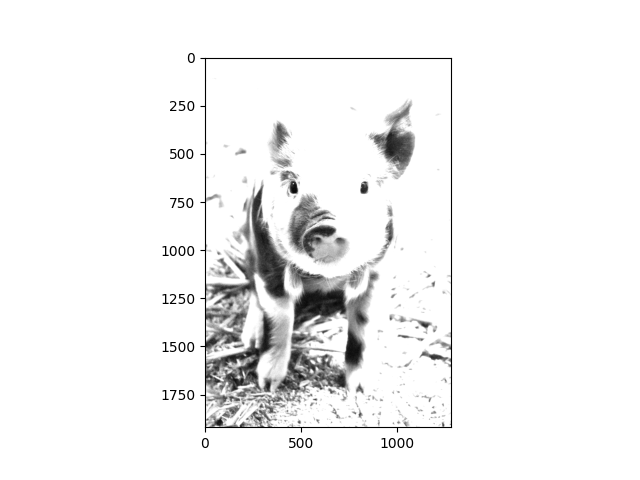
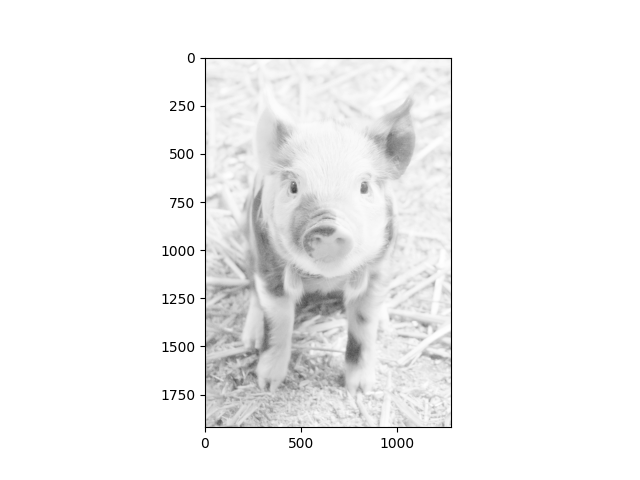
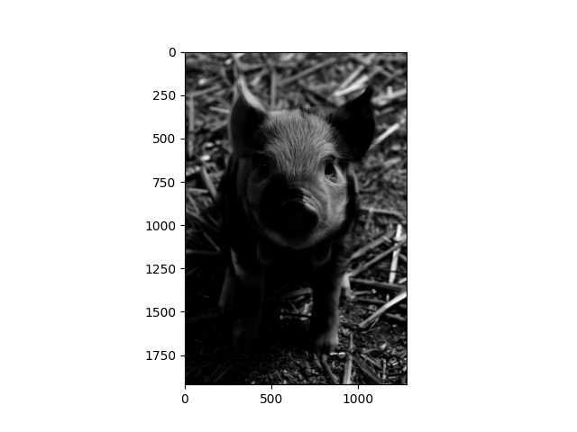
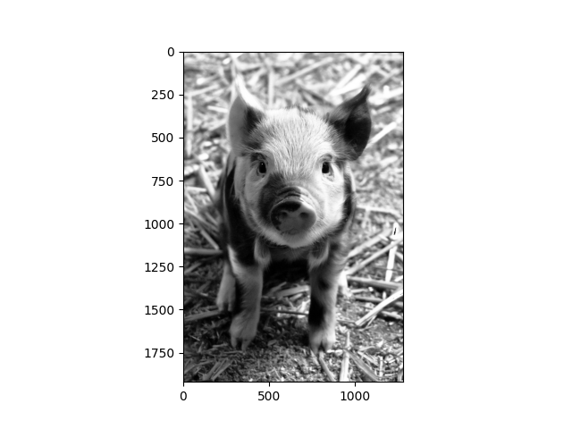
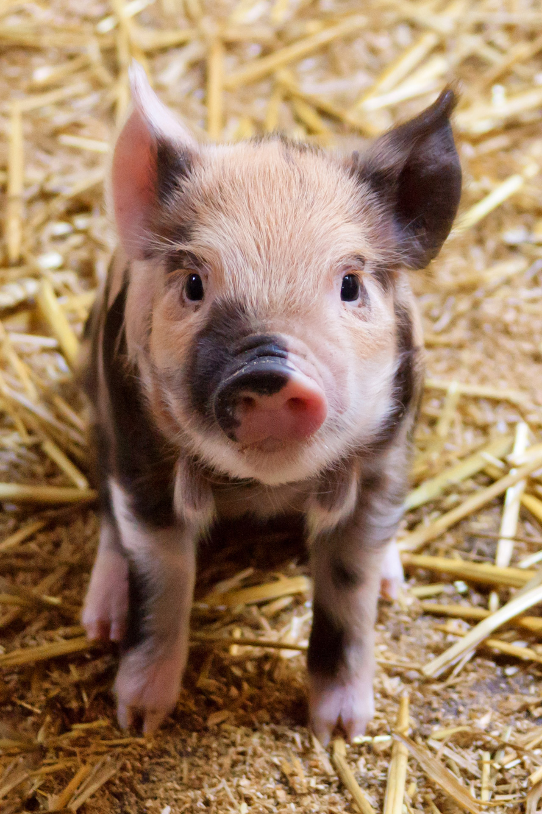

# Digital Image Processing Intensity Transformations

## Description
This project includes implementation of some intensity transformations in Digital Image Processing for 8-bit images:
- Linear transformation: $f(i) = \alpha i + \beta$ (with custom $\alpha$ and $\beta$)
- Logarithmic transformation: $f(i) = [\frac{255\ log(i+1)}{log(256)}]$
- Power-law transformation: $f(i) = [ci^\gamma]$ (with custom $\gamma$ and calculated appropriate $c$)
- Histogram equalization

## Usage
1. set "img_path" variable in "main.py" to input image's path. (Images will be converted to grayscale.)
2. Execute the python file corresponding to transformation of choice.
    - Linear transformation: linear.py
    - Logarithmic transformation: logarithmic.py
    - Power-law transformation: power_law.py
    - Histogram equalization: histogram_equalization.py
3. Enter requested custom parameters if necessary.
4. Transformed output image will be shown.

## Sample Outputs
### Grayscale input

### Linear transformation ($\alpha=2, beta=50$):

### Logarithmic transformation:

### Power-law transformation ($\gamma = 4$):

### Histogram equalization:

## Attributions
Sample image:

[Cute Piglet](https://www.publicdomainpictures.net/en/view-image.php?image=24588&picture=cute-piglet)
by [Petr Kratochvil](https://www.publicdomainpictures.net/en/browse-author.php?a=1) 
is licensed under [CC0](https://creativecommons.org/publicdomain/zero/1.0/).
